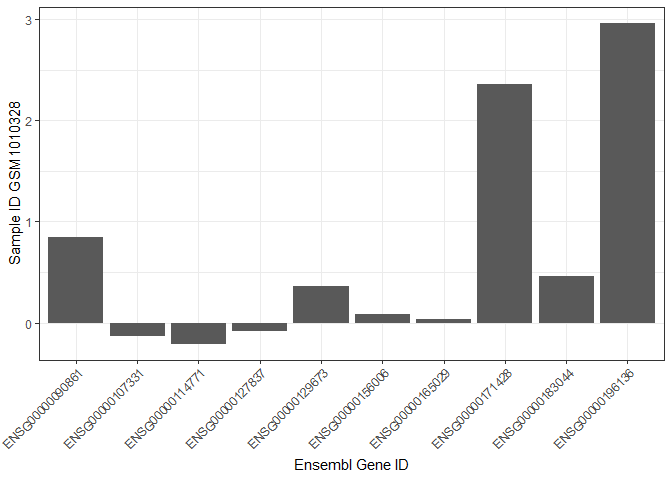
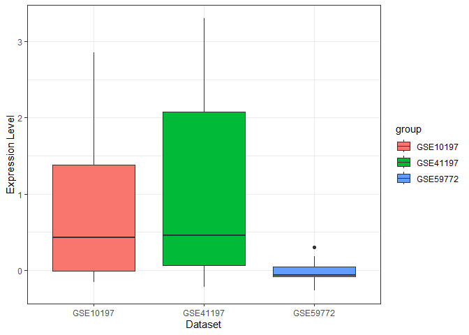
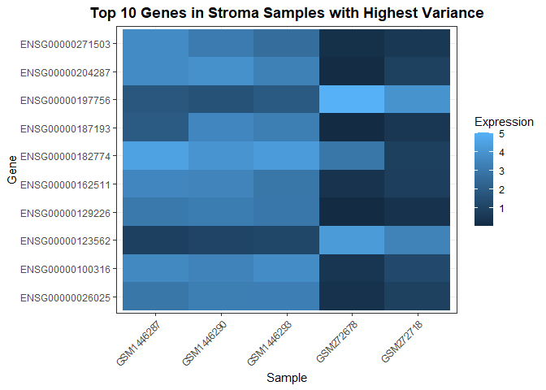
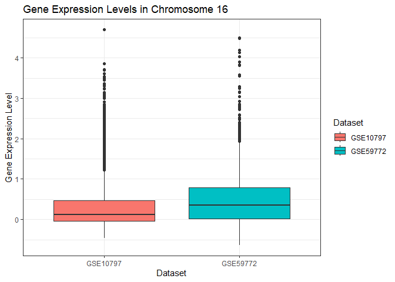

<!-- README.md is generated from README.Rmd. Please edit that file -->

# AnnotatedBCGEData

<!-- badges: start -->

[](https://github.com/srp33/AnnotatedBCGEData/issues)
[](https://github.com/srp33/AnnotatedBCGEData/pulls)
<!-- badges: end -->

`AnnotatedBCGEData` is an R package that uses the ExperimentHub
infrastructure in [Bioconductor](https://bioconductor.org/). To create
this package, we gathered more than 100 gene-expression data sets
(microarray and RNA-Sequencing) from public repositories, including
[Gene Expression Omnibus](http://www.ncbi.nlm.nih.gov/geo/),
[ArrayExpress](https://www.ebi.ac.uk/biostudies/arrayexpress), and [The
Cancer Genome
Atlas](https://www.cancer.gov/ccg/research/genome-sequencing/tcga).
Where feasible, we obtained raw data and reprocessed the data using
modern computational pipelines. Additionally, we provide metadata in an
easy-to-use format. Our goal is to provide researchers with easier
access to these data with the goal of accelerating biomedical discovery.

## Installation instructions

Get the latest stable `R` release from
[CRAN](http://cran.r-project.org/). Then install `AnnotatedBCGEData`
from [Bioconductor](http://bioconductor.org/) using the following code:

``` r
if (!requireNamespace("BiocManager", quietly = TRUE)) {
    install.packages("BiocManager")
}

BiocManager::install("AnnotatedBCGEData")
```

This code installs BiocManager if it is not already installed. Running
the if statement is required to install the package as it is dependent
on BiocManager to load.

Download the development version from
[GitHub](https://github.com/srp33/AnnotatedBCGEData) with:

``` r
BiocManager::install("srp33/AnnotatedBCGEData")
```

## Data Info

The data used in this package was accessed through
[Zenodo](https://zenodo.org/communities/annnotatedbcgedata/records?q=&l=list&p=1&s=10&sort=newest).
This database allowed us to use data that was already neat and ready to
be analyzed. However, the original data came from Gene Expression
Omnibus (GEO), ArrayExpress, and The Cancer Genome Atlas. The name of
every item in the named list identifiers is the data set name in its
respective source. Learn more about the data at the following links:

- GSE41197:
  <https://www.ncbi.nlm.nih.gov/geo/query/acc.cgi?acc=GSE41197>
- GSE10797:
  <https://www.ncbi.nlm.nih.gov/geo/query/acc.cgi?acc=GSE10797>
- GSE59772:
  <https://www.ncbi.nlm.nih.gov/geo/query/acc.cgi?acc=GSE59772>

The package itself includes a metadata file as required by Bioconductor.
This file is a table that lists the name of each object and more
information about where it came from and how it was accessed. See
inst/extdata/metadata.csv. When the package is available in
ExperimentHub, using the query() function will show available data sets.

``` r
#library(ExperimentHub)
#eh = ExperimentHub()
#query(eh, AnnotatedBCGEData)

# this code throws errors because the package is not currently available in ExperimentHub
```

## Examples

The following is the code required to access the objects within the
package. Other packages were used in the creation of the package, but
they should be automatically loaded when the package is installed. These
packages are included in the NAMESPACE file.

``` r
library(AnnotatedBCGEData)
```

Downloading this package does not download the data sets onto the user’s
machine. This package contains 2 code objects the user needs to create
and access the SummarizedExperiment object for each data set. First is a
named list object called identifiers. The second is a function called
makeObject. identifiers contains the unique URL identifiers for the
expression data file and the metadata file. Calling each data set in the
named list returns a vector with these values. These values are passed
to makeObject, which returns the SummarizedExperiment. <br> <br> To load
the SummarizedExperiment object for a data set included in
AnnotatedBCGEData, the user chooses the name of the data set from the
identifiers named list object and passes it to the function makeObject.
This function downloads the data and creates the SummarizedExperiment
object that is accessible to the user. To see a comprehensive list of
all data sets included and where they came from, see the metadata.csv
file in inst/extdata/metadata.csv. This will be accessible in the code
when the package is available in ExperimentHub. <br> <br> The
SummarizedExperiment object for each data set includes 3 matrices. The
first, which we load as expression_data, is a matrix with the samples as
columns and genes as rows. The Ensembl gene ID is used as the row names.
The data in the actual matrix is the expression level of the gene for
the sample. <br> <br> The second matrix we load as sample_metadata. This
is information about the samples themselves, such as demographics for
the patient the sample came from. The samples are rows and the
information is in the columns. <br> <br> The third matrix we load as
feature_data. This is the information about the genes that were tested
for each sample. This includes information like the chromosome the gene
is located on, the Entrez gene ID, and the gene name. The genes are the
rows and the information about the samples is in the columns.

``` r
GSE41197_SE = makeObject(identifiers$GSE41197)
#> Rows: 9593 Columns: 22
#> ── Column specification ────────────────────────────────────────────────────────
#> Delimiter: "\t"
#> chr  (5): Dataset_ID, HGNC_Symbol, Ensembl_Gene_ID, Chromosome, Gene_Biotype
#> dbl (17): Entrez_Gene_ID, GSM1010328, GSM1010329, GSM1010330, GSM1010331, GS...
#> 
#> ℹ Use `spec()` to retrieve the full column specification for this data.
#> ℹ Specify the column types or set `show_col_types = FALSE` to quiet this message.
#> Rows: 16 Columns: 5
#> ── Column specification ────────────────────────────────────────────────────────
#> Delimiter: "\t"
#> chr (5): Dataset_ID, Sample_ID, Platform_ID, Patient_ID, disease_state
#> 
#> ℹ Use `spec()` to retrieve the full column specification for this data.
#> ℹ Specify the column types or set `show_col_types = FALSE` to quiet this message.
expression_data = assay(GSE41197_SE)
sample_metadata = colData(GSE41197_SE)
feature_data = rowData(GSE41197_SE)
```

This is a simple example of using a built-in function to get a general
idea of the data. The summary() function includes data points for each
sample, like the minimum or maximum expression levels across all the
genes. Generally, this isn’t particularly relevant, but does give an
idea of how many samples are in the matrix.

``` r
gene_expression_values = assay(GSE41197_SE)
summary(gene_expression_values)
#>    GSM1010328         GSM1010329         GSM1010330        GSM1010331      
#>  Min.   :-0.58807   Min.   :-0.67193   Min.   :-0.6275   Min.   :-0.67947  
#>  1st Qu.:-0.02803   1st Qu.:-0.02844   1st Qu.:-0.0254   1st Qu.:-0.02467  
#>  Median : 0.17679   Median : 0.17441   Median : 0.1930   Median : 0.20735  
#>  Mean   : 0.35001   Mean   : 0.31648   Mean   : 0.3605   Mean   : 0.38279  
#>  3rd Qu.: 0.51888   3rd Qu.: 0.49118   3rd Qu.: 0.5426   3rd Qu.: 0.58618  
#>  Max.   : 5.89482   Max.   : 5.60029   Max.   : 5.6386   Max.   : 5.22921  
#>    GSM1010332         GSM1010333         GSM1010335         GSM1010336      
#>  Min.   :-0.65721   Min.   :-0.68931   Min.   :-0.80612   Min.   :-0.76911  
#>  1st Qu.:-0.02692   1st Qu.:-0.02032   1st Qu.:-0.01329   1st Qu.:-0.01469  
#>  Median : 0.19357   Median : 0.19358   Median : 0.18998   Median : 0.19855  
#>  Mean   : 0.38505   Mean   : 0.35555   Mean   : 0.34023   Mean   : 0.34292  
#>  3rd Qu.: 0.57769   3rd Qu.: 0.53875   3rd Qu.: 0.50096   3rd Qu.: 0.54229  
#>  Max.   : 5.53771   Max.   : 5.48663   Max.   : 5.15454   Max.   : 5.49399  
#>    GSM1010337         GSM1010338         GSM1010339        GSM1010340      
#>  Min.   :-0.62034   Min.   :-0.73287   Min.   :-0.7865   Min.   :-0.68037  
#>  1st Qu.:-0.02902   1st Qu.:-0.01651   1st Qu.:-0.0320   1st Qu.:-0.01358  
#>  Median : 0.16572   Median : 0.19661   Median : 0.1650   Median : 0.23907  
#>  Mean   : 0.34074   Mean   : 0.35117   Mean   : 0.3178   Mean   : 0.42135  
#>  3rd Qu.: 0.49122   3rd Qu.: 0.53256   3rd Qu.: 0.4736   3rd Qu.: 0.65615  
#>  Max.   : 7.47123   Max.   : 5.35866   Max.   : 6.0962   Max.   : 5.20654  
#>    GSM1010341         GSM1010342          GSM1010344          GSM1010345      
#>  Min.   :-0.71538   Min.   :-0.727634   Min.   :-0.745922   Min.   :-0.73491  
#>  1st Qu.:-0.02971   1st Qu.:-0.004102   1st Qu.:-0.009581   1st Qu.:-0.01498  
#>  Median : 0.19966   Median : 0.228113   Median : 0.199796   Median : 0.22331  
#>  Mean   : 0.39275   Mean   : 0.408147   Mean   : 0.361049   Mean   : 0.38596  
#>  3rd Qu.: 0.59964   3rd Qu.: 0.624571   3rd Qu.: 0.527265   3rd Qu.: 0.62029  
#>  Max.   : 4.58676   Max.   : 4.715135   Max.   : 5.045097   Max.   : 4.98164
```

In the following example, we first access the matrix of gene expression
values. To make it easier to analyze, we convert it into a tibble and
select the first 10 rows. We then used ggplot() to create a bar plot
showing the gene expression levels for one sample across 10 genes.

``` r
GSE41197 = makeObject(identifiers$GSE41197)
#> Rows: 9593 Columns: 22
#> ── Column specification ────────────────────────────────────────────────────────
#> Delimiter: "\t"
#> chr  (5): Dataset_ID, HGNC_Symbol, Ensembl_Gene_ID, Chromosome, Gene_Biotype
#> dbl (17): Entrez_Gene_ID, GSM1010328, GSM1010329, GSM1010330, GSM1010331, GS...
#> 
#> ℹ Use `spec()` to retrieve the full column specification for this data.
#> ℹ Specify the column types or set `show_col_types = FALSE` to quiet this message.
#> Rows: 16 Columns: 5
#> ── Column specification ────────────────────────────────────────────────────────
#> Delimiter: "\t"
#> chr (5): Dataset_ID, Sample_ID, Platform_ID, Patient_ID, disease_state
#> 
#> ℹ Use `spec()` to retrieve the full column specification for this data.
#> ℹ Specify the column types or set `show_col_types = FALSE` to quiet this message.
gene_expression_values = assay(GSE41197)

exp_tib = as_tibble(gene_expression_values, rownames='Ensembl_Gene_ID')[1:10,] %>%
    ggplot(aes(x=Ensembl_Gene_ID, y=GSM1010328)) +
    geom_col() +
    labs(x='Ensembl Gene ID',y='Sample ID GSM1010328') +
    theme_bw() +
    theme(axis.text.x = element_text(angle = 45, hjust = 1))

exp_tib
```



Here, we first accessed the matrices for 3 data sets included in
AnnotatedBCGEData.

``` r
GSE10797_SE = makeObject(identifiers$GSE10797)
#> Rows: 13744 Columns: 31
#> ── Column specification ────────────────────────────────────────────────────────
#> Delimiter: "\t"
#> chr  (5): Dataset_ID, HGNC_Symbol, Ensembl_Gene_ID, Chromosome, Gene_Biotype
#> dbl (26): Entrez_Gene_ID, GSM272671, GSM272673, GSM272675, GSM272677, GSM272...
#> 
#> ℹ Use `spec()` to retrieve the full column specification for this data.
#> ℹ Specify the column types or set `show_col_types = FALSE` to quiet this message.
#> Rows: 25 Columns: 5
#> ── Column specification ────────────────────────────────────────────────────────
#> Delimiter: "\t"
#> chr (5): Dataset_ID, Sample_ID, Platform_ID, replicate, tissue_source
#> 
#> ℹ Use `spec()` to retrieve the full column specification for this data.
#> ℹ Specify the column types or set `show_col_types = FALSE` to quiet this message.
GSE41197_SE = makeObject(identifiers$GSE41197)
#> Rows: 9593 Columns: 22
#> ── Column specification ────────────────────────────────────────────────────────
#> Delimiter: "\t"
#> chr  (5): Dataset_ID, HGNC_Symbol, Ensembl_Gene_ID, Chromosome, Gene_Biotype
#> dbl (17): Entrez_Gene_ID, GSM1010328, GSM1010329, GSM1010330, GSM1010331, GS...
#> 
#> ℹ Use `spec()` to retrieve the full column specification for this data.
#> ℹ Specify the column types or set `show_col_types = FALSE` to quiet this message.
#> Rows: 16 Columns: 5
#> ── Column specification ────────────────────────────────────────────────────────
#> Delimiter: "\t"
#> chr (5): Dataset_ID, Sample_ID, Platform_ID, Patient_ID, disease_state
#> 
#> ℹ Use `spec()` to retrieve the full column specification for this data.
#> ℹ Specify the column types or set `show_col_types = FALSE` to quiet this message.
GSE59772_SE = makeObject(identifiers$GSE59772)
#> Rows: 21659 Columns: 15
#> ── Column specification ────────────────────────────────────────────────────────
#> Delimiter: "\t"
#> chr  (5): Dataset_ID, HGNC_Symbol, Ensembl_Gene_ID, Chromosome, Gene_Biotype
#> dbl (10): Entrez_Gene_ID, GSM1446286, GSM1446287, GSM1446288, GSM1446289, GS...
#> 
#> ℹ Use `spec()` to retrieve the full column specification for this data.
#> ℹ Specify the column types or set `show_col_types = FALSE` to quiet this message.
#> Rows: 9 Columns: 5
#> ── Column specification ────────────────────────────────────────────────────────
#> Delimiter: "\t"
#> chr (5): Dataset_ID, Sample_ID, Platform_ID, replicate, tissue
#> 
#> ℹ Use `spec()` to retrieve the full column specification for this data.
#> ℹ Specify the column types or set `show_col_types = FALSE` to quiet this message.

GSE10197 = assay(GSE10797_SE)
GSE41197 = assay(GSE41197_SE)
GSE59772 = assay(GSE59772_SE)
```

Next, we converted each to a tibble and selected one row, representing
one gene that we knew each data set had in common. We rotated the
tibbles to have one column (the gene) and many rows (the sample). Then,
we added the ‘group’ column, which was necessary for the function used
in the next step.

``` r
GSE10197_gene = GSE10197 %>%
    as_tibble(rownames='Ensembl_Gene_ID') %>%
    filter(Ensembl_Gene_ID == "ENSG00000171428") %>%
    pivot_longer(cols=-Ensembl_Gene_ID,names_to='Sample_ID',values_to='Expression_Level')%>%
    mutate(group = 'GSE10197')
GSE41197_gene = GSE41197 %>%
    as_tibble(rownames='Ensembl_Gene_ID') %>%
    filter(Ensembl_Gene_ID == "ENSG00000171428") %>%
    pivot_longer(cols=-Ensembl_Gene_ID,names_to='Sample_ID',values_to='Expression_Level')%>%
    mutate(group = 'GSE41197')
GSE59772_gene = GSE59772 %>%
    as_tibble(rownames='Ensembl_Gene_ID') %>%
    filter(Ensembl_Gene_ID == "ENSG00000171428") %>%
    pivot_longer(cols=-Ensembl_Gene_ID,names_to='Sample_ID',values_to='Expression_Level')%>%
    mutate(group = 'GSE59772')
```

We then joined the 3 tibbles into one tibble with the bind_rows()
function. We now have one tibble with one column (the gene) and many
rows (the samples). <br> <br> Finally, we used ggplot() to visualize the
expression levels for the gene across the three data sets.

``` r
combined_samples = bind_rows(GSE10197_gene, GSE41197_gene, GSE59772_gene)

ggplot(combined_samples, aes(x = group, y = Expression_Level, fill = group)) +
    geom_boxplot() +
    labs(x = "Dataset", y = "Expression Level") +
    theme_bw()
```



In this example, we combine using both the metadata and the expression
data to create a heat map of gene expression levels.<br> First, we load
the data sets, turn them into tibbles, and extract both the metadata and
expression data. We then filter the expression to only include the
samples that are identified as stroma cells. Finally, we create two
vectors with all the gene names in each tibble to set them up for
comparison.

``` r
GSE59772 = makeObject(identifiers$GSE59772)
#> Rows: 21659 Columns: 15
#> ── Column specification ────────────────────────────────────────────────────────
#> Delimiter: "\t"
#> chr  (5): Dataset_ID, HGNC_Symbol, Ensembl_Gene_ID, Chromosome, Gene_Biotype
#> dbl (10): Entrez_Gene_ID, GSM1446286, GSM1446287, GSM1446288, GSM1446289, GS...
#> 
#> ℹ Use `spec()` to retrieve the full column specification for this data.
#> ℹ Specify the column types or set `show_col_types = FALSE` to quiet this message.
#> Rows: 9 Columns: 5
#> ── Column specification ────────────────────────────────────────────────────────
#> Delimiter: "\t"
#> chr (5): Dataset_ID, Sample_ID, Platform_ID, replicate, tissue
#> 
#> ℹ Use `spec()` to retrieve the full column specification for this data.
#> ℹ Specify the column types or set `show_col_types = FALSE` to quiet this message.
GSE59772_metadata = colData(GSE59772) %>%
    as_tibble(rownames = 'Sample_ID')

GSE59772_stroma_samples = filter(GSE59772_metadata, tissue == 'Stroma') %>%
    pull(Sample_ID)

GSE59772_gene_names = assay(GSE59772) %>%
    as_tibble(rownames="Ensembl_Gene_ID") %>%
    pull(Ensembl_Gene_ID)


GSE10797 = makeObject(identifiers$GSE10797)
#> Rows: 13744 Columns: 31
#> ── Column specification ────────────────────────────────────────────────────────
#> Delimiter: "\t"
#> chr  (5): Dataset_ID, HGNC_Symbol, Ensembl_Gene_ID, Chromosome, Gene_Biotype
#> dbl (26): Entrez_Gene_ID, GSM272671, GSM272673, GSM272675, GSM272677, GSM272...
#> 
#> ℹ Use `spec()` to retrieve the full column specification for this data.
#> ℹ Specify the column types or set `show_col_types = FALSE` to quiet this message.
#> Rows: 25 Columns: 5
#> ── Column specification ────────────────────────────────────────────────────────
#> Delimiter: "\t"
#> chr (5): Dataset_ID, Sample_ID, Platform_ID, replicate, tissue_source
#> 
#> ℹ Use `spec()` to retrieve the full column specification for this data.
#> ℹ Specify the column types or set `show_col_types = FALSE` to quiet this message.
GSE10797_metadata = colData(GSE10797) %>%
    as_tibble(rownames = 'Sample_ID')

GSE10797_gene_names = assay(GSE10797) %>%
    as_tibble(rownames="Ensembl_Gene_ID") %>%
    pull(Ensembl_Gene_ID)

GSE10797_stroma_samples = filter(GSE10797_metadata, tissue_source == 'stromal cells from breast cancer patient')%>%
    pull(Sample_ID)
```

Next, we create a vector that has only the names of the genes the data
sets have in common. We use this vector to filter the expression tibbles
again to only include rows with genes in the vector.

``` r
common_genes = c()
for (gene in GSE59772_gene_names) {
    if (gene %in% GSE10797_gene_names) {
        common_genes = c(common_genes, gene)
    }
}

GSE59772_stroma_expressions = assay(GSE59772) %>%
    as_tibble(rownames= 'Ensembl_Gene_ID') %>%
    select(Ensembl_Gene_ID, all_of(GSE59772_stroma_samples)) %>%
    filter(Ensembl_Gene_ID %in% common_genes)
    
GSE10797_stroma_expressions = assay(GSE10797) %>%
    as_tibble(rownames = 'Ensembl_Gene_ID') %>%
    select(Ensembl_Gene_ID, all_of(GSE10797_stroma_samples)) %>% 
    filter(Ensembl_Gene_ID %in% common_genes)
```

Finally, we combine the data into one tibble called combined_data. We
make a new row called variance that calculates the variance across the 5
samples. We select the top 10 rows, those with greatest variance. We
then use ggplot to create a heat map of the genes with the top variance,
displayed below.

``` r
combined_data = full_join(GSE10797_stroma_expressions, GSE59772_stroma_expressions)
#> Joining with `by = join_by(Ensembl_Gene_ID)`
top_variance_genes = combined_data %>%
    rowwise() %>%
    mutate(variance = var(c_across(starts_with('GSM')))) %>%
    ungroup() %>%
    arrange(desc(variance)) %>%
    slice_head(n=10)

top_variance_map = top_variance_genes %>%
    select(-variance) %>%
    pivot_longer(cols = starts_with('GSM'), names_to = 'Sample_ID', values_to = 'Expression') %>%
    ggplot(aes(x = Sample_ID, y = Ensembl_Gene_ID, fill = Expression)) +
    geom_tile()+
    labs(x = 'Sample', y = 'Gene', fill = 'Expression', title = 'Top 10 Genes in Stroma Samples with Highest Variance') + 
    theme_bw() + 
    theme(axis.text.x = element_text(angle = 45, hjust = 1), plot.title = element_text(hjust = 0.5, face = "bold"))
top_variance_map
```



In this final example, we use aspects of the feature data along with the
expression data. <br> <br>

First, we get the feature data and convert it to a tibble. We then
filter this data for each data set to only include genes on chromosome
16. Similar to the last example, we also make a vector with the gene
names the data sets have in common.

``` r
GSE59772 = makeObject(identifiers$GSE59772)
#> Rows: 21659 Columns: 15
#> ── Column specification ────────────────────────────────────────────────────────
#> Delimiter: "\t"
#> chr  (5): Dataset_ID, HGNC_Symbol, Ensembl_Gene_ID, Chromosome, Gene_Biotype
#> dbl (10): Entrez_Gene_ID, GSM1446286, GSM1446287, GSM1446288, GSM1446289, GS...
#> 
#> ℹ Use `spec()` to retrieve the full column specification for this data.
#> ℹ Specify the column types or set `show_col_types = FALSE` to quiet this message.
#> Rows: 9 Columns: 5
#> ── Column specification ────────────────────────────────────────────────────────
#> Delimiter: "\t"
#> chr (5): Dataset_ID, Sample_ID, Platform_ID, replicate, tissue
#> 
#> ℹ Use `spec()` to retrieve the full column specification for this data.
#> ℹ Specify the column types or set `show_col_types = FALSE` to quiet this message.
GSE59772_featuredata = rowData(GSE59772) %>%
    as_tibble(rownames = 'Ensembl_Gene_ID')

GSE59772_chr16 = GSE59772_featuredata %>%
    filter(Chromosome == '16') %>%
    pull(Ensembl_Gene_ID)

GSE59772_gene_names = assay(GSE59772) %>%
    as_tibble(rownames="Ensembl_Gene_ID") %>%
    pull(Ensembl_Gene_ID)


GSE10797 = makeObject(identifiers$GSE10797)
#> Rows: 13744 Columns: 31
#> ── Column specification ────────────────────────────────────────────────────────
#> Delimiter: "\t"
#> chr  (5): Dataset_ID, HGNC_Symbol, Ensembl_Gene_ID, Chromosome, Gene_Biotype
#> dbl (26): Entrez_Gene_ID, GSM272671, GSM272673, GSM272675, GSM272677, GSM272...
#> 
#> ℹ Use `spec()` to retrieve the full column specification for this data.
#> ℹ Specify the column types or set `show_col_types = FALSE` to quiet this message.
#> Rows: 25 Columns: 5
#> ── Column specification ────────────────────────────────────────────────────────
#> Delimiter: "\t"
#> chr (5): Dataset_ID, Sample_ID, Platform_ID, replicate, tissue_source
#> 
#> ℹ Use `spec()` to retrieve the full column specification for this data.
#> ℹ Specify the column types or set `show_col_types = FALSE` to quiet this message.
GSE10797_featuredata = rowData(GSE10797) %>%
    as_tibble(rownames = 'Ensembl_Gene_ID')

GSE10797_chr16 = GSE10797_featuredata %>%
    filter(Chromosome == '16') %>%
    pull(Ensembl_Gene_ID)

GSE10797_gene_names = assay(GSE10797) %>%
    as_tibble(rownames="Ensembl_Gene_ID") %>%
    pull(Ensembl_Gene_ID)


common_genes = c()
for (gene in GSE59772_gene_names) {
    if (gene %in% GSE10797_gene_names) {
        common_genes = c(common_genes, gene)
    }
}
```

Next, we filter the expression data to include only genes on chromosome
16, then filter again to only include genes the data sets have in
common. We pivot and mutate to make the data ready for the boxplot.

``` r
GSE10797_chr16_common = assay(GSE10797) %>%
    as_tibble(rownames = 'Ensembl_Gene_ID') %>%
    filter(Ensembl_Gene_ID %in% GSE10797_chr16) %>%
    filter(Ensembl_Gene_ID %in% common_genes) %>%
    pivot_longer(cols=-Ensembl_Gene_ID,names_to='Sample_ID',values_to='Expression_Level')%>%
    mutate(Dataset = 'GSE10797')

GSE59772_chr16_common = assay(GSE59772) %>%
    as_tibble(rownames = 'Ensembl_Gene_ID') %>%
    filter(Ensembl_Gene_ID %in% GSE59772_chr16) %>%
    filter(Ensembl_Gene_ID %in% common_genes) %>%
    pivot_longer(cols=-Ensembl_Gene_ID,names_to='Sample_ID',values_to='Expression_Level')%>%
    mutate(Dataset = 'GSE59772')
```

Finally, we combine the data sets using bind_rows() and read it into a
ggplot.

``` r
combined_data = bind_rows(GSE10797_chr16_common, GSE59772_chr16_common) %>%
    ggplot(aes(x = Dataset, y = Expression_Level, fill = Dataset)) +
    geom_boxplot() +
    theme_bw() +
    labs(x = 'Dataset', y='Gene Expression Level', title = 'Gene Expression Levels in Chromosome 16') 
combined_data
```



## Citation

Below is the citation output from using `citation('AnnotatedBCGEData')`
in R. Please run this yourself to check for any updates on how to cite
**AnnotatedBCGEData**.

``` r
print(citation('AnnotatedBCGEData'), bibtex = TRUE)
#> To cite package 'AnnotatedBCGEData' in publications use:
#> 
#>   Steadman H, Lo S (2025). _AnnotatedBCGEData: 100+ Breast Cancer Gene
#>   Expression Data sets_. R package version 0.99.0,
#>   <https://github.com/srp33/AnnotatedBCGEData>.
#> 
#> A BibTeX entry for LaTeX users is
#> 
#>   @Manual{,
#>     title = {AnnotatedBCGEData: 100+ Breast Cancer Gene Expression Data sets},
#>     author = {Heidi Steadman and Sophie Lo},
#>     year = {2025},
#>     note = {R package version 0.99.0},
#>     url = {https://github.com/srp33/AnnotatedBCGEData},
#>   }
```

Please note that the `AnnotatedBCGEData` was only made possible thanks
to many other R and bioinformatics software authors, which are cited
either in the vignettes and/or the paper(s) describing this package.

## Development tools

- Continuous code testing is possible thanks to [GitHub
  actions](https://www.tidyverse.org/blog/2020/04/usethis-1-6-0/)
  through *[usethis](https://CRAN.R-project.org/package=usethis)*,
  *[remotes](https://CRAN.R-project.org/package=remotes)*, and
  *[rcmdcheck](https://CRAN.R-project.org/package=rcmdcheck)* customized
  to use [Bioconductor’s docker
  containers](https://www.bioconductor.org/help/docker/) and
  *[BiocCheck](https://bioconductor.org/packages/3.22/BiocCheck)*.
- Code coverage assessment is possible thanks to
  [codecov](https://codecov.io/gh) and
  *[covr](https://CRAN.R-project.org/package=covr)*.
- The code is styled automatically thanks to
  *[styler](https://CRAN.R-project.org/package=styler)*.
- The documentation is formatted thanks to
  *[devtools](https://CRAN.R-project.org/package=devtools)* and
  *[roxygen2](https://CRAN.R-project.org/package=roxygen2)*.

This package was developed using
*[biocthis](https://bioconductor.org/packages/3.22/biocthis)*.
